# 🤖 ARIA — Autonomous Career Intelligence System

> A local-first, production-grade career intelligence engine that runs 24/7 on your machine —
> scraping opportunities, scoring them against your real skill profile, generating tailored resumes,
> and delivering a morning briefing to your phone. No cloud dependency. No vendor lock-in.

[](https://github.com/rosalinatorres888/aria-career-assistant)
[](https://python.org)
[](https://fastapi.tiangolo.com)
[](https://mongodb.com)
[](https://ollama.ai)
[](LICENSE)

---

## What ARIA Actually Does

Most job search tools are passive — they wait for you to show up. ARIA runs whether you're at your desk or not.

Every morning, a 7-stage orchestrated pipeline runs automatically:

1. **Scrapes** live job postings from Built In Boston and MongoDB-cached sources
2. **Scores** every posting against your actual skill profile (55 verified skills) using `sentence-transformers` `all-MiniLM-L6-v2` — runs fully local, no API calls
3. **Qualifies** jobs above threshold into a ranked pipeline
4. **Generates** archetype-matched resumes (AI_ML, Data_Engineering, Analytics, Governance_Ethics) via Ollama/Mistral (local LLM)
5. **Syncs** results into Memory Brain (SQLite) for cross-session intelligence
6. **Composes** a daily HTML digest with qualified jobs and application status
7. **Delivers** morning briefing to iPhone via iMessage — no app required

The dashboard at `localhost:5100` gives you a live view of your pipeline, job scoring, and the embedded JAIA Resume Builder for on-demand resume generation against any job description.

---

## System Architecture



> 🖱️ **[View Interactive Version →](https://rosalinatorres888.github.io/aria-career-assistant/aria_architecture.html)**
> Click any node to explore technical details, stack, and implementation notes.

---

## Stack

| Component | Technology | Purpose |
|---|---|---|
| **API Backend** | FastAPI (Python) | REST endpoints, dashboard serving |
| **Job Storage** | MongoDB `aria_career` | Document store for job postings, 147+ records |
| **Intelligence DB** | SQLite `central_memory.db` | Cross-session memory, agent activity, job master |
| **Semantic Matching** | `sentence-transformers` — `all-MiniLM-L6-v2` | Cosine similarity against 55-skill profile, fully local |
| **LLM Generation** | Ollama — `mistral`, `llama3`, `tinyllama` | Resume enhancement, cover letter drafts |
| **Orchestration** | ROSE OS `rose_orchestrator.py` | 7-stage daily pipeline with stage isolation |
| **Alerts** | macOS iMessage (AppleScript) | Morning briefing delivery to iPhone |
| **Dashboard** | HTML/JS + JAIA Resume Builder | Live pipeline view, on-demand resume generation |
| **Launch** | `bash ~/Desktop/launch_career.sh` | Starts MongoDB, ARIA, Memory Brain in sequence |

**Design principle: local-first.** All AI generation routes through Ollama. No cloud API costs, no data leaving the machine, no rate limits.

---

## Semantic Matching — How It Actually Works

ARIA scores each job posting against 55 verified skills loaded from `rosalina_resume_master.json`, using `sentence-transformers` `all-MiniLM-L6-v2`. No cloud API. No Ollama. Runs entirely on-device.

```python
# _score_job() in aria_integrations.py
job_emb    = self._semantic_matcher.model.encode([job_text])
skills_emb = self._semantic_matcher.model.encode(self._semantic_matcher.all_skills)
sims       = cosine_similarity(job_emb, skills_emb)[0]

# Average of top 5 skill matches — rewards depth, not breadth
semantic_score = float(np.mean(np.sort(sims)[-5:]))

# Composite score
confidence = (
    semantic_score * 0.65 +   # Primary signal
    location_score * 0.20 +   # Boston / remote match
    recency_score  * 0.15     # Posted within 14 days
) - neg_penalty               # Deducted for negative keyword hits
```

Jobs with excluded companies (configurable in `aria_job_config.py`) are zeroed out before scoring. Keyword matches are stored separately on the job document for display in the dashboard.

---

## JAIA Resume Builder

Embedded in the ARIA dashboard as a dedicated tab, the JAIA (Job Application Intelligence Agent) Resume Builder provides:

- **Left panel:** Paste any job description → AI extracts requirements → Ollama/Mistral enhances bullet points against your real project history
- **Right panel:** 6-section resume builder (Summary, Experience, Projects, Skills, Education, Certifications)
- **Export:** One-click `.docx` download

Backend lives at `~/Documents/memory-brain-integration/resume_server.py` (port 5200), separate from the main repo. All generation is local via Ollama — no OpenAI key required.

---

## ROSE OS Integration

ARIA is one node in a larger autonomous career operating system. The 7-stage `rose_orchestrator.py` coordinates:

```
Stage 1  aria_scrape         → Scrapes and caches live jobs
Stage 2  bridge              → Normalizes ARIA jobs for downstream agents
Stage 3  pod_pipeline        → Scout → Analyst → Ghostwriter agent chain
Stage 4  canvas_sync         → NEU Canvas → Notion (academic deadlines)
Stage 5  health_check        → Validates Memory Brain + pipeline integrity
Stage 6  digest              → Generates HTML daily summary
Stage 7  imessage_briefing   → Delivers morning briefing to iPhone
```

Stage isolation means a failure in Canvas sync doesn't block the job pipeline or iMessage delivery. Each stage logs to `central_memory.db` via the Memory Brain Data Bus.

---

## Local Setup

### Prerequisites

- Python 3.11+
- MongoDB running locally (`mongod --config /opt/homebrew/etc/mongod.conf --fork`)
- Ollama with `mistral` and `llama3` pulled (`ollama pull mistral`)
- Secrets configured at `~/.aria_secrets`

### Launch

```bash
# Start everything
bash ~/Desktop/launch_career.sh

# Or manually:
mongod --config /opt/homebrew/etc/mongod.conf --fork
cd ~/Desktop/Projects/aria-career-assistant
source venv/bin/activate
python aria_api.py
# Dashboard → http://localhost:5100
# Resume server → http://localhost:5200
```

### Environment

```bash
cp .env.example .env
# Configure: MongoDB URI, Gmail IMAP credentials, Ollama endpoint
```

---

## Project Structure

```
aria-career-assistant/
├── aria_api.py                  # FastAPI backend + dashboard server (port 5100)
├── aria_dashboard.html          # Frontend dashboard with Resume Builder tab
├── aria_integrations.py         # OpportunityScanner, ApplicationTracker, alerts
├── aria_job_config.py           # Target titles, keywords, scoring weights
├── resume_builder.py            # Resume builder script (in-repo)
│                                # Note: resume_server.py (port 5200) lives at
│                                # ~/Documents/memory-brain-integration/resume_server.py
├── aria_diagram.svg             # Animated architecture diagram (inline README)
├── aria_architecture.html       # Interactive architecture diagram (GitHub Pages)
├── src/
│   └── aria.py                  # Core agent entry point
├── config/
│   └── aria_config.yaml         # Endpoints, thresholds, archetype weights
├── requirements.txt
├── .env.example
└── .gitignore
```

---

## Roadmap

### Completed ✅
- Semantic job scoring (all-MiniLM-L6-v2, 55-skill profile)
- MongoDB pipeline with 147+ job records
- FastAPI backend with live dashboard
- Archetype detection (4 career modes)
- Local LLM resume generation via Ollama
- ROSE OS 7-stage orchestration with stage isolation
- iMessage morning briefing
- JAIA Resume Builder embedded in dashboard (port 5200)
- Memory Brain integration (central_memory.db)

### In Progress 🚧
- LinkedIn outbound connection automation
- Recruiter email drafting agent
- GitHub repo sync from resume projects
- Application status auto-tracking from Gmail

### Planned 📋
- Multi-user support (separate MongoDB namespaces)
- REST API for external integrations
- Weekly analytics digest with trend analysis
- A/B testing on resume archetype performance

---

## Academic Context

**Program:** MS Data Analytics Engineering — Northeastern University (EDGE)
**Expected Graduation:** August 2026
**Role:** Graduate Research Associate & Conference Presenter

ARIA is a production system, not a class project. It runs daily and directly supports an active job search targeting ML/AI engineering roles. The ROSE OS orchestration layer was designed and built concurrently with coursework in Statistical Learning (IE7600) and Machine Learning & Analytics (DADS7275).

---

## Author

**Rosalina Torres** — ML/AI Engineer
MS Data Analytics Engineering @ Northeastern University

- **LinkedIn:** [linkedin.com/in/rosalina-torres](https://linkedin.com/in/rosalina-torres)
- **GitHub:** [@rosalinatorres888](https://github.com/rosalinatorres888)
- **Portfolio:** [rosalina.sites.northeastern.edu](https://rosalina.sites.northeastern.edu)
- **Email:** torres.ros@northeastern.edu

---

## License

MIT License — See LICENSE file for details

---

*Part of the ROSE OS career intelligence ecosystem — built to replace manual job searching with autonomous, data-driven opportunity detection.*
